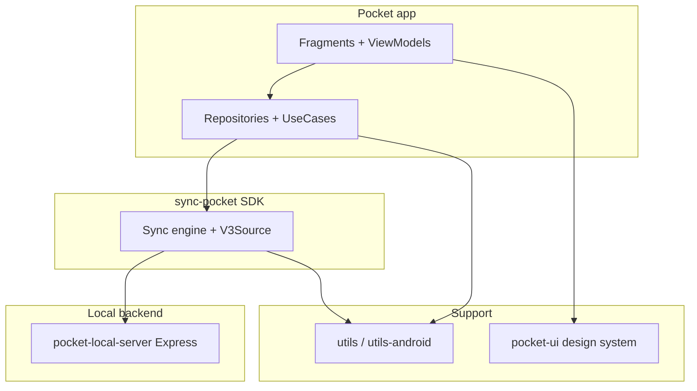
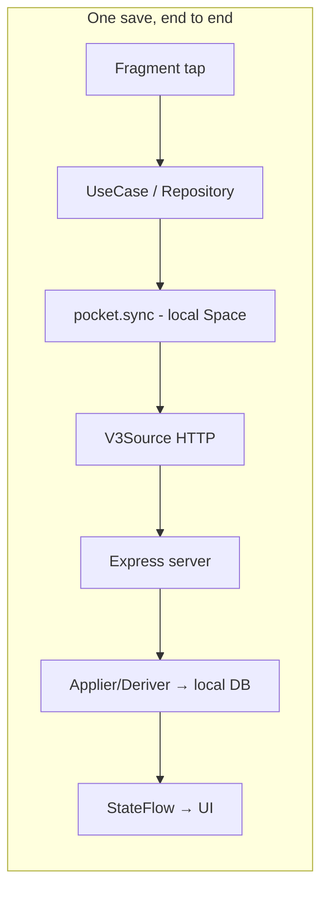
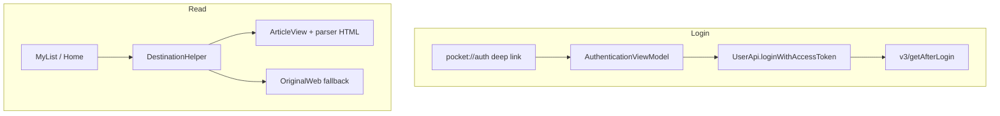
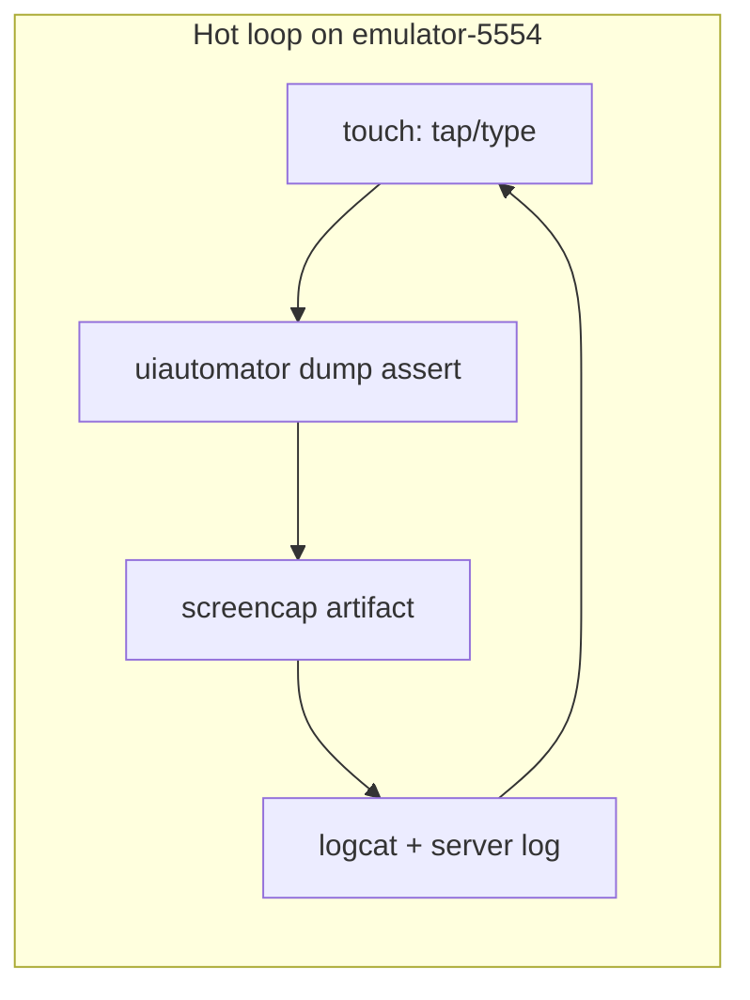
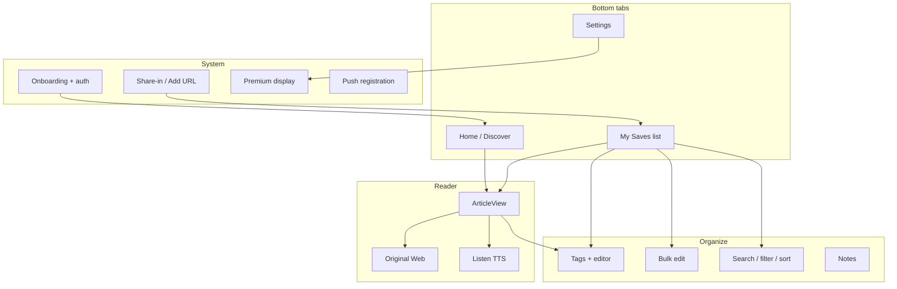

# Pocket Android — Analytics-Stripped PoC (`just-app`)

## What this is
Local-build PoC: all analytics/telemetry event plumbing removed. Builds
`Pocket:assembleDevelopDebug` with **zero secrets** (no `secrets/secret.properties`, no env keys).

Build: `./gradlew clean Pocket:assembleDevelopDebug --console=plain`
Output: `Pocket/build/outputs/apk/develop/debug/Pocket-develop-debug.apk`
(`com.ideashower.readitlater.pro.dev`, 8.33.0.0). Verified clean-tree green.

## What was removed
- Top-level `analytics/` module (Snowplow `Tracker`, `UiEntityable`/`Engageable` APIs,
  appevents, entities) + `settings.gradle.kts` include + `projects.analytics` deps.
- `Pocket/src/main/java/com/pocket/analytics/` telemetry impls (`PocketTracker`,
  `ContentOpenTracker`, `BrowserAnalytics`, `ViewableImpressionScrollListener`,
  `ImpressionableInfoPageAdapter`) and `SaveExtensionAnalytics`.
- Tracker DI: `providePocketTracker` provider, `App.tracker()`/`PocketApp.tracker()`,
  all `@Inject tracker` fields, `app().tracker().*` / `tracker.*` call statements,
  `ViewableImpressionScrollListener` wiring in adapters/fragments,
  `ImpressionableInfoPageAdapter` usages (replaced with plain `InfoPageAdapter`).
- Analytics view interfaces in `pocket-ui`: `UiEntityable`/`Engageable` impls, helpers,
  `entityType`/`engageable` ctor params, `setUiEntity*`/`getEngagement*` methods.
  Public view APIs unchanged otherwise.
- `onItemViewed` telemetry chain (interface method + empty overrides + impression
  callback) where the only consumer was impression tracking.

## What was kept / faked locally
- `Project.getSecret()` returns `""` when secrets are absent (release signing never
  built here); debug build type uses the AGP debug keystore (no `TEAM` signingConfig).
- `res/font/graphik.xml` points at system `sans-serif` (XML only); `Fonts.get()` maps Graphik/Blanco/Doyle to system sans/serif at runtime (`pocket_icons.ttf` still loads from assets). Verified boot on emulator API 36. (proprietary fonts are
  secrets-gated). Cosmetic only.
- Premium forced unlocked for local builds (`// ponytail:` markers):
  `LoginInfo.hasPremium() = true`, `PocketCache.hasPremium/hasFeature = true`,
  `isPremiumUpgradeAvailable = false`.
- `SavesTab` (was `analytics.appevents.SavesTab`, but drives list-tab behavior):
  recreated as `com.pocket.app.list.SavesTab` with identical values.
- `willShowChooser` simplified to `preferredBrowserPackageName == null`
  (dropped telemetry-derived default-browser check).

## Not in scope (follow-ups)
- Vendor SDK wrappers still wired: Braze (`BrazeManager`), Sentry (`SentryManager`),
  Adjust (`AdjustSdkComponent`), FCM/push, install-referrer, billing. Stripping them
  is a separate cascade (App/PocketModule/Manifest/gradle deps).
- `PremiumAnalytics` (self-contained, sdk2-based) still constructed in
  `PremiumPurchaseFragment`; its tracking calls were removed.
- `// TODO(notes): tracker.track(...)` comments left in `MyListViewModel` as notes.

## Phase 2 — local backend + e2e (verified on emulator-5554, API 36)

- `pocket-local-server/` (Express, `node --watch server.js`, host 0.0.0.0:8080):
  `v3/guid`, `v3/send_guid`, `v3/send`, `v3/get`, `v3/fetch`, `v3/getAfterLogin`,
  `/parser`, `/graphql`. Wire shapes mirror `sync-pocket` unit tests and `V3Source` docs.
- App points at it in source (debug-gated via BuildConfig.DEBUG; release keeps production URLs) (`PocketServer.API_PRODUCTION`,
  `V3Source.PRODUCTION_SERVER`, ClientApi graphql URL, parser default all local);
  BetaConfig UI selector still works. No secrets, cleartext allowed by base config.
- Proven loop: fake login via `pocket://auth` deep link → share Wikipedia URL →
  `v3/send` add → list sync shows card → tap → ArticleView renders parsed HTML.
- Schema sources, strongest first: `sync-pocket/src/main/graphql/*.graphqls`
  (v3/parser/local/adzerk/snowplow), generated model classes under
  `sync-pocket/build/generated/`, `V3Source.java` protocol docs, unit tests.

## F-Droid single flavor (verified on emulator-5554, API 36)

- One flavor only (`fdroid`, base applicationId, `MARKET_KEY "fdroid"`); team/play
  flavors, team signing config, and `TEAM_RELEASE` build type deleted. `DEBUG` and
  `UNSIGNED_RELEASE` remain (F-Droid signs itself).
- Vendor SDKs removed end to end: Adjust, Braze (+notification receiver),
  Sentry (+OkHttp interceptor/listener), AppCenter distribute, Firebase messaging,
  Play Billing (+whole `sdk/premium/billing/` tree and purchase UI), install-referrer.
  Remaining: `PktPush` is a no-op, `ErrorHandler` logs to logcat, `AlphaBuild.setup()`
  is empty, purchase entry points route to premium settings display.
- Resources: `braze.xml` (main + unsignedRelease), Braze styles, GMS version meta,
  FCM service + Braze receiver manifest entries deleted. `SwipeRefreshLayout` is a
  direct Pocket dependency (databinding requires it, transitive was insufficient).
- APK: `Pocket/build/outputs/apk/fdroid/debug/Pocket-fdroid-debug.apk`
  (`com.ideashower.readitlater.pro`, 8.33.0.0), zero secrets, clean-tree green.
- Screenshot-verified on fdroid build: onboarding, Home with synced Wikipedia card,
  parsed ArticleView render, Settings. Backend: `pocket-local-server` on host :8080,
  all app traffic observed at `10.0.2.2:8080`, production endpoints removed from source
  (debug-gated where a release path still exists).

## Reading guide: docs/ in order (for a Kotlin developer new to Android)

You only need Kotlin plus the concepts each step introduces. Read in numbered order;
each row says exactly which `docs/` files to open. Paths below are relative to `docs/`
and each maps 1:1 to a repo file (`docs/<path>.md` describes `<path>`).

### Map first: how the pieces connect

### Phase 1 — build the thing (30 min)

| # | Read (docs/ path) | Why now / what you learn |
|---|-------------------|--------------------------|
| 1 | `settings.gradle.kts.md` | Module list; what each module is for. |
| 2 | `Pocket/build.gradle.kts.md` | Single `fdroid` flavor, debug/unsignedRelease types, key dependencies. |
| 3 | `gradle/libs.versions.toml.md` | Version catalog: where every dependency version lives. |
| 4 | `buildSrc/src/main/kotlin/utils/pocket/Configs.kt.md` + `VariantFilters.kt.md` | Flavor/build-type constants and which variants may build. |
| 5 | `Pocket/src/main/AndroidManifest.xml.md` | Activities, deep links (`pocket://auth`), providers, permissions. |

Run: `./gradlew Pocket:assembleFdroidDebug`. Output APK is at
`Pocket/build/outputs/apk/fdroid/debug/`.

### Phase 2 — the sync engine (core; 2–3 hours)

| # | Read (docs/ path) | Why now / what you learn |
|---|-------------------|--------------------------|
| 6 | `sync-gen/src/main/java/...` (any 2 `docs/sync-gen/**.md`) | Codegen: `.graphqls` specs become the generated model classes; never edit generated output. |
| 7 | `sync/src/main/java/com/pocket/sync/source/*.md` (PocketSource, AppSource) | Local Space vs Remote Source; `remember`/`sync`/`syncRemote` semantics. |
| 8 | `sync-pocket/src/main/java/com/pocket/sdk/api/source/V3Source.java.md` | v3 REST transport: `server + /v3/ + path`, credentials, `action_results` envelope. |
| 9 | `sync-pocket/src/main/java/com/pocket/sdk/api/source/PocketRemoteSource.java.md` | How v3/parser/GraphQL/Adzerk/Snowplow sources combine; which ctor the app uses. |
| 10 | `sync-pocket/src/main/graphql/v3.graphqls.md` + `parser.graphqls.md` | Wire schema: thing/action field names the server must mirror. |
| 11 | `Pocket/src/main/java/com/pocket/repository/ItemRepository.kt.md` | `save(url)` = one `add`-action sync; the canonical write path. |
| 12 | `Pocket/src/main/java/com/pocket/usecase/Save.kt.md` | Login gate (`NotLoggedIn` when `access_token` is null). |

### Phase 3 — app shell: login, list, reader (2 hours)

| # | Read (docs/ path) | Why now / what you learn |
|---|-------------------|--------------------------|
| 13 | `Pocket/src/main/java/com/pocket/app/App.java.md` + `PocketModule.kt.md` + `PocketSingleton.java.md` | Hilt graph: what gets injected where; how the `Pocket` sync instance is built. (Hilt = constructor parameters provided automatically; `@Singleton` = one instance.) |
| 14 | `Pocket/src/main/java/com/pocket/app/auth/AuthenticationViewModel.kt.md` + `AuthenticationFragment.kt.md` | Login seam: deep link → credentials → `loginWithAccessToken` → persisted `LoginInfo`. |
| 15 | `Pocket/src/main/java/com/pocket/repository/UserRepository.kt.md` | `isLoggedIn()` = `access_token != null`; the single auth fact the UI trusts. |
| 16 | `Pocket/src/main/java/com/pocket/app/list/MyListViewModel.kt.md` + `MyListFragment.kt.md` | List screen: fetch/sync, `SavesTab` filter, navigation events. |
| 17 | `Pocket/src/main/java/com/pocket/app/home/HomeViewModel.kt.md` + `HomeFragment.kt.md` | Home lineup, staleness rules, overflow sheets. |
| 18 | `Pocket/src/main/java/com/pocket/app/reader/DestinationHelper.kt.md` | ARTICLE vs ORIGINAL_WEB routing (`is_article`, saved state, kill switch). |
| 19 | `Pocket/src/main/java/com/pocket/repository/ArticleRepository.kt.md` + `Pocket/src/main/java/com/pocket/app/reader/internal/article/ArticleViewModel.kt.md` | `getArticleHtml` → offline cache → JS bridge into local asset shell; `loadArticleHtml` is the sole caller. |

### Phase 4 — UI system and support libs (1 hour)

| # | Read (docs/ path) | Why now / what you learn |
|---|-------------------|--------------------------|
| 20 | `pocket-ui/src/main/java/com/pocket/ui/view/themed/ThemedConstraintLayout2.kt.md` + `ThemedLinearLayout.kt.md` | Themed base views every screen builds on (styling + night mode). |
| 21 | Any 3 `docs/pocket-ui/src/main/java/com/pocket/ui/view/**/*.md` (e.g. chip, badge, snackbar) | Widget pattern: attrs, binding, ViewModel wiring. |
| 22 | `pocket-ui/src/main/java/com/pocket/ui/text/Fonts.java.md` | System-font fallback table; `pocket_icons.ttf` still asset-loaded. |
| 23 | `Pocket/src/main/res/layout/frag_my_list.xml.md` + `Pocket/src/main/res/layout/fragment_article.xml.md` | Databinding in practice: variables → ViewModel fields, `@{}` click expressions. (Databinding = XML layouts bound to observable fields.) |
| 24 | `utils-android/src/main/java/com/pocket/util/prefs/*.md` (any 2) + `Pocket/src/main/java/com/pocket/sdk/api/PocketServer.java.md` | Prefs groups + endpoint selection (`dcfig_` keys, per-flavor defaults). |

### Phase 5 — backend + verification loop (1 hour)

| # | Read (docs/ path) | Why now / what you learn |
|---|-------------------|--------------------------|
| 25 | `pocket-local-server/package.json.md` + `pocket-local-server/server.js.md` | Express routes; request log as protocol oracle; `node --watch` reload. |
| 26 | `scripts/*.md` (each present script) | Automation entry points for build/test loops. |
| 27 | Re-read `Pocket/src/main/java/com/pocket/sdk/api/source/V3Source.java.md` | Now map each route you implemented to the doc section that specified it. |

### Done when
You can whiteboard the save→sync→list→reader flow naming the exact classes, run `./gradlew clean Pocket:assembleFdroidDebug` green with zero secrets, and drive login→save→ArticleView on the emulator using only `adb` + the server log.

## Feature flows: every capability, organized

Conventions for every flow below: entry screen → ViewModel → repository/sync → exit screen.
All paths are `docs/` files (`docs/<path>.md` describes `<path>`).

### 1. Onboarding + auth
`app/auth/AuthenticationActivity.java` hosts `AuthenticationFragment.kt` (intro pager,
sign-in, skip). `AuthenticationViewModel.kt:100 onCredentialsReceived` parses the
`pocket://auth` deep link and calls `userApi.loginWithAccessToken`; `UserManager.kt`
persists via `PocketCache`. Logged-in state is a single fact:
`repository/UserRepository.kt` (`access_token != null`). Signed-out users get the
signed-out experience flag instead of Home data.

### 2. Home / Discover
`app/home/HomeFragment.kt` + `HomeViewModel.kt`: lineup slates + topics + banners with a
12-hour staleness rule and mutex-serialized refresh. Tapping a slate opens
`details/slates/SlateDetailsFragment.kt` or `details/topics/TopicDetailsFragment.kt`
(both extend `details/DetailsFragment.kt` + `DetailsViewModel.kt`). Card overflows open
`slates/overflow/RecommendationOverflowBottomSheetFragment.kt`; reporting opens
`slates/overflow/report/ReportItemBottomSheetFragment.kt` (+ ViewModel with local
`ReportReason` sealed class). `home/views/` holds hero/wide-hero/minor card renderers.

### 3. Saves list
`app/list/MyListFragment.kt` + `MyListViewModel.kt` + `list/ListManager.kt`: tabs driven by
local `SavesTab` (`app/list/SavesTab.kt`: SAVES vs ARCHIVE), search text, filter/sort
sheets (`list/filter/`, `list/list/overflow/ItemOverflowBottomSheetFragment.kt`), tag chips
(`TagsAdapter`), bulk-edit mode (`list/bulkedit/` with snackbar actions),
add-URL sheet (`list/add/AddUrlBottomSheetFragment.kt`), overflow per row. Premium-gated
search uses forced-unlocked `pocketCache.hasPremium()`.

### 4. Reader
`app/reader/ReaderFragment.kt` + `ReaderViewModel.kt` hosts two destinations chosen by
`app/reader/DestinationHelper.kt` (article needs `is_article` + saved + killswitch off):
`internal/article/ArticleFragment.kt` renders parser HTML (see `ArticleViewModel.kt:110
loadArticleHtml`), `internal/originalweb/OriginalWebFragment.kt` renders the live page
with `OriginalWebBottomSheetFragment.kt` actions (share, tags, favorite, mark viewed,
switch-to-article). Inside article view: highlights (`article/highlights/`), text+font
settings sheets (`article/textsettings/`, `fontSettings/`), find-in-page, share sheet,
`EndOfArticleRecommendationsViewModel.kt`, `internal/collection/CollectionFragment.kt`
for collection URLs. Kill switch: `internal/article/ArticleViewKillSwitchFlag.kt`.

### 5. Listen (text-to-speech)
`app/listen/ListenView.kt` + controls/player/speed views render playback; TTS parsing is
`speakable` utterance extraction in `sdk/tts/` (jsoup is used here for utterance parsing,
not article parsing). Settings live in `ListenSettingsFragment.java`. No audio leaves the
device beyond article text already fetched.

### 6. Tags, notes, overflow actions
Tagging UI: `app/tags/ItemsTaggingFragment.java` (+ editor/ subpackage) and
`app/list/tags/TagBottomSheetFragment.kt`. Notes: `app/notes/Notes.kt` + note-details
screens. Row overflow (`ItemOverflowBottomSheetFragment`) routes favorite/archive/delete/
share/tag/mark-viewed into `ItemRepository` sync actions.

### 7. Share-in / Add URL
`app/add/AddActivity.java` receives `ACTION_SEND`/view intents, `AddItemFromIntentUtil.kt`
extracts the URL, `usecase/Save.kt` login-gates, `ItemRepository.save()` posts the `add`
sync action. Toast/snackbar confirms; the item appears after list sync.

### 8. Settings
`app/settings/PrefsFragment.kt` hosts sections: `account/` (management, premium status
display), `appicon/`, `cache/` (offline storage limits), `rotation/` lock view,
`premium/` display-only screen (`PremiumSettingsFragment`), `beta/` (Team Config:
API/parser/server prefs incl. local backend selection), `view/` preference row widgets,
`Theme.java`, `SystemDarkTheme.java`, `UserAgent.java`, `Brightness.java`,
`AbsPrefsFragment.java` base, `OpenSourceLicensesFragment.kt`, `OptionsDialogs.java`
(push opt-in), `Help.java`. Premium display reads forced-unlocked cache (no checkout;
purchase chain deleted).

### 9. Premium display (no purchasing)
`app/premium/Premium.java` routes all upgrade entry points to the settings display;
`DeepLinks.java` `premium`/`premium_settings` links do the same. Settings shows status +
features from the server account payload; checkout, billing SDK, and product lists are
deleted. Upgrade/renew screens do not exist in this variant.

### 10. Push registration (FCM kept, delivery external)
`sdk/notification/push/PktPush.kt` implements `Push.java` (token, availability,
register/deregister/invalidate) against FirebaseMessaging; `push/firebase/
FcmMessageService.kt` receives messages (silent sync triggers) with no Braze branch.
Token registration posts `register_push` sync actions. Actual radio delivery needs real
FCM credentials and is outside local e2e; registration + local handling is what the
loop verifies.
